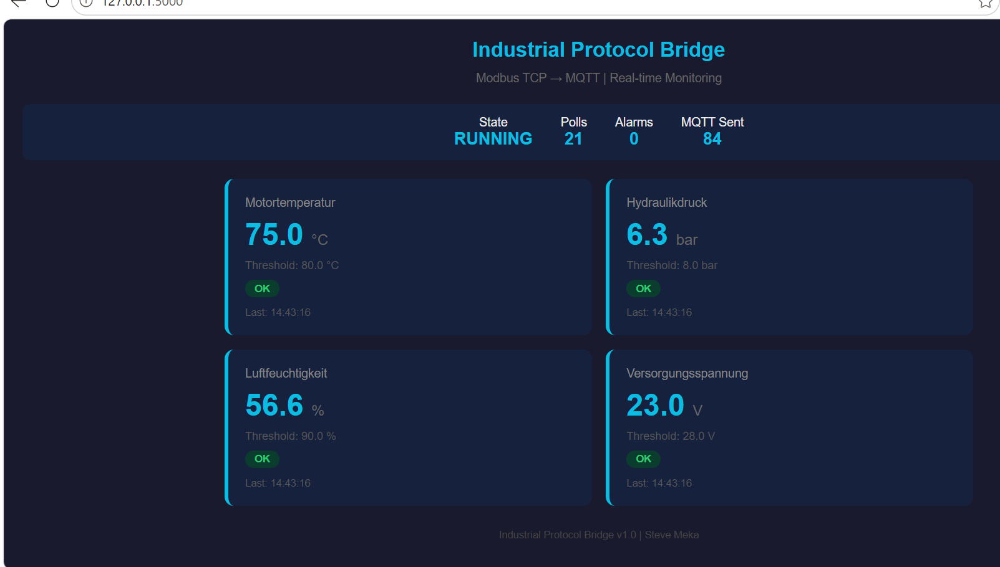
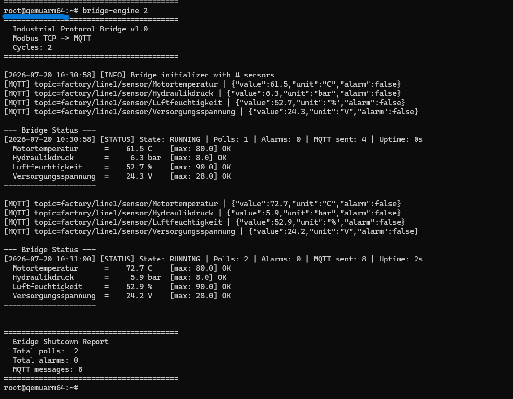

# Industrial Protocol Bridge (Yocto ARM64)

A custom Yocto-based embedded Linux system that bridges legacy industrial protocols (Modbus TCP) to modern IoT protocols (MQTT), enabling Industry 4.0 connectivity.

Built from scratch with a custom Yocto layer, Dockerized build environment, and CI/CD pipeline.

## What it does

Modbus TCP Devices MQTT Broker / Cloud
(sensors, PLCs) (mosquitto)
| ^
v |
+-----------+ +-------------+ |
| Modbus |--->| Bridge |---+
| Client | | Engine (C) |
+-----------+ +-------------+
|
+-----------+
| REST API |
| Dashboard |
| (Flask) |
+-----------+

**Bridge Engine** reads 4 industrial sensors via Modbus TCP, monitors thresholds, triggers alarms, and publishes JSON data to MQTT topics.

**Web Dashboard** provides real-time visualization of all sensor values, alarm states, and system status.

## Monitored Sensors

| Sensor | Unit | Alarm Threshold |
|--------|------|-----------------|
| Motortemperatur | °C | > 80.0 |
| Hydraulikdruck | bar | > 8.0 |
| Luftfeuchtigkeit | % | > 90.0 |
| Versorgungsspannung | V | > 28.0 |

## Tech Stack

- **OS**: Custom Yocto Linux (Scarthgap) for QEMU ARM64
- **Bridge Engine**: C (Modbus TCP client, MQTT publisher, threshold monitoring)
- **Web Dashboard**: Python Flask (REST API, real-time UI)
- **Build**: Dockerized Yocto build environment
- **CI/CD**: GitHub Actions (build, test, lint)
- **Target**: QEMU ARM64 (emulated ARM Cortex-A53), portable to BeagleY-AI

## Project Structure

yocto-industrial-bridge/
├── meta-steve-embedded/ # Custom Yocto layer
│ ├── conf/layer.conf # Layer configuration
│ ├── recipes-app/
│ │ ├── bridge-engine/ # C application recipe
│ │ │ ├── bridge-engine_1.0.bb
│ │ │ └── files/
│ │ │ ├── bridge_engine.c
│ │ │ └── Makefile
│ │ └── web-dashboard/ # Flask dashboard recipe
│ │ └── files/app.py
│ └── recipes-core/images/
│ └── bridge-image.bb # Custom image definition
├── docker/Dockerfile # Reproducible build environment
├── scripts/docker-build.sh # Build automation script
├── docs/ # Screenshots and diagrams
└── .github/workflows/build.yml # CI/CD pipeline

## Quick Start

### Build locally (requires Yocto dependencies)
```bash
git clone https://github.com/meka23749/yocto-industrial-bridge.git
cd yocto-industrial-bridge

# Clone Poky
git clone -b scarthgap git://git.yoctoproject.org/poky ../poky

# Initialize build
source ../poky/oe-init-build-env build
echo 'MACHINE ?= "qemuarm64"' >> conf/local.conf
bitbake-layers add-layer ../yocto-industrial-bridge/meta-steve-embedded

# Build image
bitbake bridge-image

# Boot on QEMU
runqemu qemuarm64 nographic
# Login: root (no password)
# Run: bridge-engine 5
```

### Build with Docker
```bash
docker build -t yocto-bridge -f docker/Dockerfile .
docker run -it yocto-bridge
```

### Test locally (without Yocto)
```bash
# Bridge Engine
cd meta-steve-embedded/recipes-app/bridge-engine/files
make && ./bridge-engine 3

# Web Dashboard
cd meta-steve-embedded/recipes-app/web-dashboard/files
pip install flask
python3 app.py
# Open: http://localhost:5000
```

## Screenshots

### Bridge Engine running on QEMU ARM64


### Web Dashboard


### QEMU Boot


## CI/CD Pipeline

Three parallel jobs on every push:
- **Build**: Compiles bridge-engine (C)
- **Test**: Validates Flask dashboard API endpoints
- **Lint**: Static analysis with cppcheck, recipe validation

## Author

**Steve Meka** — Embedded Software Engineer

- Website: [stevkmef.com](https://www.stevkmef.com)
- GitHub: [meka23749](https://github.com/meka23749)
